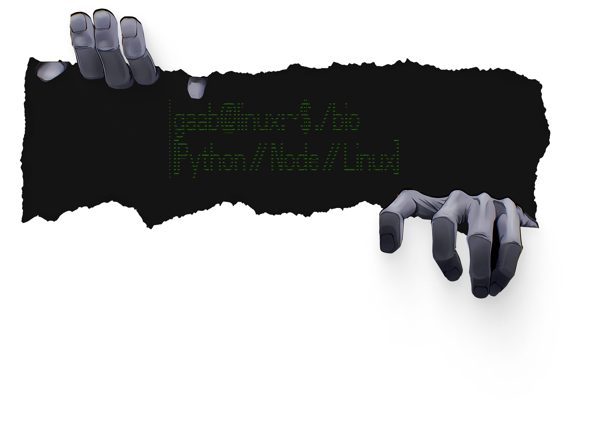

  

  
  
  
  
  
  
  

---

<h2 style="border-bottom: none; padding-bottom: 0;">Sobre mim</h2>

Olá — sou desenvolvedor <strong>fullstack</strong> em formação, com foco em <strong>automação</strong> e em sistemas que não desperdiçam tempo humano em tarefa repetitiva. Gosto de ligar APIs, dados e ferramentas do dia a dia para que o trabalho flua, não de empilhar buzzwords.

<strong>Como penso sobre rotina:</strong> se algo leva mais de ~10 minutos por dia e sempre é do mesmo jeito, prefiro investir uma vez em script, bot ou pipeline e deixar a máquina cuidar do resto.

---

<h2 style="border-bottom: none; padding-bottom: 0;">Foco no momento</h2>

<ul>
  <li>Construir coisas <strong>úteis de verdade</strong> (menos demo superficial, mais problema real).</li>
  <li>Melhorar <strong>documentação e organização</strong> de ideias técnicas — especialmente quando o material nasce caótico (aula, log, rascunho).</li>
  <li>Afinar <strong>automação</strong> sem virar Frankenstein: código legível, módulos com responsabilidade clara, espaço para crescer.</li>
</ul>

---

<h2 style="border-bottom: none; padding-bottom: 0;">Projetos em destaque</h2>

  

Automação de mensageria em partes separadas (`Node.js`, `Python`): integrações, regras e “entrega” não ficam grudadas no mesmo arquivo gigante. Objetivo é manter simples de mudar quando o canal ou o fluxo muda.

  

Conteúdo estático + IA: registros de aula (logs, notas) viram **Markdown técnico** com estrutura previsível — visão geral, exemplos, laboratório — bom para revisar e publicar depois.

  

Ambiente Linux do jeito que eu uso (`Bash`, `Lua`): tema, atalhos, pequenos scripts. Menos “show” e mais **conforto** para codar e alternar entre terminal, janelas e editor.

<!-- Ajuste os href acima se os slugs dos repositórios forem diferentes. -->

---

<h2 style="border-bottom: none; padding-bottom: 0;">Stack e ferramentas</h2>

Uso **`Python`** para automação e scripts, **`JavaScript` / `Node.js`** quando entra web ou serviço. **`Linux`** (Arch ou Debian) como base, **`Git`** com commits no estilo [Conventional Commits](https://www.conventionalcommits.org/), e **`Docker`** quando preciso que o ambiente seja o mesmo em qualquer máquina. No editor: **`Neovim`** ou VS Code com movimento estilo Vim — o que importa é não perder tempo com fricção desnecessária.

  
  
  
  
  
  
  
  

---

<h2 style="border-bottom: none; padding-bottom: 0;">Atividade no GitHub</h2>

  

  

  

  <table border="0" cellspacing="0" cellpadding="0" style="border: none; border-collapse: collapse;">
    <tr>
      <td align="center" valign="top" style="border: none; padding: 0 8px 0 0;">
        
      </td>
      <td align="center" valign="top" style="border: none; padding: 0 0 0 8px;">
        
      </td>
    </tr>
  </table>

---

## Aprendizado e contato

Sigo estudando **ADS** na Infnet e testando ideias nos repositórios acima. Se algo aqui te parecer útil ou quiser sugerir melhoria, issue ou PR são bem-vindos.

<!-- Ajuste os href de Portfólio e Instagram quando tiver os links definitivos. -->

  <a href="https://www.linkedin.com/in/gabrielroesedecarli/" style="display: inline-block; padding: 0 22px;"> LinkedIn</a>
  <a href="https://github.com/GaabDevWeb" style="display: inline-block; padding: 0 22px;"> GitHub</a>
  <a href="gaml.ai/gaabdev" style="display: inline-block; padding: 0 22px;"> Portfólio</a>
  <a href="https://www.instagram.com/gaabdev/" style="display: inline-block; padding: 0 22px;"> Instagram</a>

